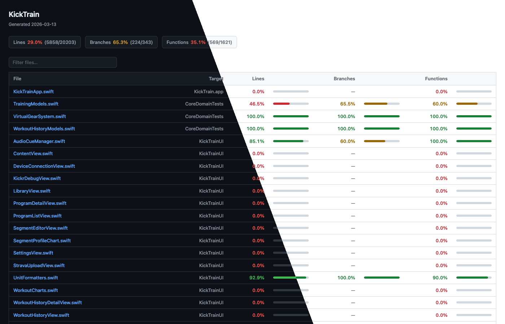
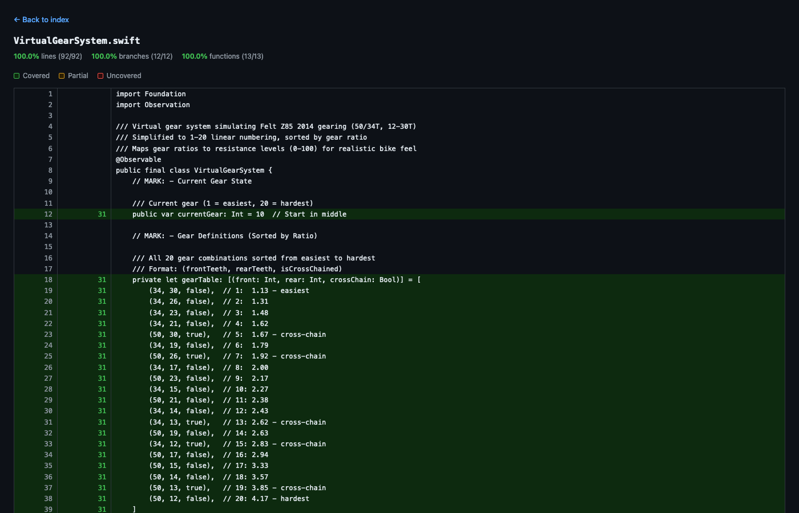

# fullcoverage

A Swift CLI tool that reads an Xcode `.xcresult` bundle and generates a multi-file static HTML coverage report — similar to [Slather](https://github.com/SlatherOrg/slather) or [Kover](https://kotlin.github.io/kover/), but with no extra toolchain required.

Coverage data is sourced entirely from `xcrun xccov`, which means it works with modern Xcode xcresult bundles out of the box. Branch coverage is derived from xccov's per-line `subranges`, which encode sub-expression hit counts.





## Features

- **Lines, branches, and functions** coverage per file and in aggregate
- Partial branch detection (yellow highlighting) from sub-expression subranges
- Parallel per-file xccov calls with live progress — fast on any number of cores
- Static HTML output — no server, no JavaScript framework, works offline
- Dark-mode stylesheet with automatic light/dark switching
- Sortable columns and live file filter on the index page
- Keyboard shortcuts (`n` / `p`) to jump between uncovered lines in file pages
- CI quality gate — exit non-zero when coverage falls below a threshold
- GitHub Actions step summary written automatically when running in CI
- JSON output for uploading to Codecov, Coveralls, or custom scripts
- SVG badge generation for embedding in a README
- Filter by Xcode target, glob include/exclude patterns
- Group the index by target or by CODEOWNERS team

## Requirements

- macOS 13+
- Xcode or the Xcode command-line tools

## Installation

### Homebrew (recommended)

```bash
brew tap Shadester/tap
brew install fullcoverage
```

### Mint

If you use [Mint](https://github.com/yonaskolb/Mint) for Swift CLI tools:

```bash
mint install Shadester/fullcoverage
```

### curl

```bash
curl -L https://github.com/Shadester/fullcoverage/releases/latest/download/fullcoverage-macos.tar.gz \
  | tar xz -C /usr/local/bin
```

### Build from source

```bash
git clone https://github.com/Shadester/fullcoverage
cd fullcoverage
swift build -c release
cp .build/release/fullcoverage /usr/local/bin/
```

## Usage

### 1. Run your tests with coverage enabled

```bash
xcodebuild test \
  -workspace MyApp.xcworkspace \
  -scheme MyApp \
  -destination "platform=iOS Simulator,name=iPhone 16" \
  -enableCodeCoverage YES \
  -resultBundlePath /tmp/MyApp.xcresult
```

Alternatively, enable coverage permanently in your scheme or test plan:

**Xcode UI:** Product → Scheme → Edit Scheme → Test → Options → Code Coverage → check *Gather coverage*

**`.xctestplan` file:**
```json
{
  "defaultOptions": {
    "codeCoverageEnabled": true
  }
}
```

### 2. Generate the report

```bash
fullcoverage /tmp/MyApp.xcresult -o ./coverage
open ./coverage/index.html
```

### Options

```
USAGE: fullcoverage <xcresult> [options]

ARGUMENTS:
  <xcresult>             Path to the .xcresult bundle

OPTIONS:
  -o, --output <dir>     Output directory (default: coverage)
  -j, --jobs <n>         Parallel workers (default: CPU count)
  --ignore <pattern>     Glob pattern for files to exclude (repeatable)
  --include <pattern>    Glob pattern for files to include (repeatable)
  --config <file>        Config file path (default: .fullcoverage.yml)
  --title <string>       Report heading (default: fullcoverage)
  --format <format>      Output format: html (default), json, all
  --sort <order>         Sort order: name (default), coverage, lines, branches, functions
  --group-by <group>     Group rows: none (default), target, codeowners
  --codeowners <file>    Path to CODEOWNERS (auto-discovered if omitted)
  --target <name>        Only include files from this Xcode target
  --min-lines <pct>      Minimum line coverage % — exits 1 if not met
  --min-branches <pct>   Minimum branch coverage %
  --min-functions <pct>  Minimum function coverage %
  --badge <path>         Write an SVG badge to this path
  --open                 Open index.html in the browser after generation
  -h, --help             Show help
```

## Config file

Commit a `.fullcoverage.yml` to your repo so you never have to repeat flags:

```yaml
# .fullcoverage.yml
output: docs/coverage
title: "MyApp Coverage"
jobs: 16
ignore:
  - "*Tests*"
  - "*.generated.swift"
  - "*/Pods/*"
include: []
target: MyApp
sort: coverage
min_lines: 80
min_branches: 60
min_functions: 80
```

CLI flags take precedence over config file values. `--ignore` and `--include` extend the config lists rather than replacing them.

```bash
# Use config file defaults
fullcoverage App.xcresult

# Override output dir for this run
fullcoverage App.xcresult -o /tmp/coverage-preview

# Point to a non-default config
fullcoverage App.xcresult --config ci/coverage.yml
```

## CI integration

### Quality gate

Pass `--min-lines` (and optionally `--min-branches`, `--min-functions`) to fail the build when coverage drops below a threshold. The report is still written before the process exits, so you can upload or inspect it regardless.

```bash
fullcoverage App.xcresult -o coverage \
  --min-lines 80 \
  --min-branches 60

# exits 0 if thresholds are met, 1 otherwise:
# Coverage threshold failure(s):
#   • Line coverage 74.2% < 80.0% required
```

### GitHub Actions

```yaml
- name: Install fullcoverage
  run: brew install Shadester/tap/fullcoverage

- name: Run tests
  run: |
    xcodebuild test \
      -scheme MyApp \
      -destination "platform=iOS Simulator,name=iPhone 16" \
      -enableCodeCoverage YES \
      -resultBundlePath coverage.xcresult

- name: Generate coverage report
  run: fullcoverage coverage.xcresult -o coverage --min-lines 80

- name: Upload report
  uses: actions/upload-artifact@v4
  with:
    name: coverage-report
    path: coverage/
```

When running in GitHub Actions, fullcoverage automatically writes a Markdown coverage table to `$GITHUB_STEP_SUMMARY`, which appears directly on the PR checks page — no need to host or upload the HTML report.

### Xcode Cloud

Xcode Cloud runs custom shell scripts from a `ci_scripts/` directory at the root of your `.xcodeproj` or `.xcworkspace`. There is no Homebrew or sudo, so install the pre-built binary into `$HOME/.local/bin`.

**`ci_scripts/ci_post_clone.sh`** — runs once after the repo is cloned:

```bash
#!/bin/bash -e
mkdir -p "$HOME/.local/bin"
curl -fsSL https://github.com/Shadester/fullcoverage/releases/latest/download/fullcoverage-macos.tar.gz \
  | tar xz -C "$HOME/.local/bin"
```

**`ci_scripts/ci_post_xcodebuild.sh`** — runs after xcodebuild finishes:

```bash
#!/bin/bash -e

# Only run when a test action produced an xcresult
[ -n "$CI_RESULT_BUNDLE_PATH" ] || exit 0

"$HOME/.local/bin/fullcoverage" "$CI_RESULT_BUNDLE_PATH" \
  -o "$CI_ARTIFACTS_PATH/coverage" \
  --min-lines 80
```

Both scripts must be committed as executable:

```bash
chmod +x ci_scripts/ci_post_clone.sh ci_scripts/ci_post_xcodebuild.sh
```

The HTML report is written to `$CI_ARTIFACTS_PATH/coverage`, which makes it downloadable from the build detail page in Xcode Cloud. `--min-lines`, `--min-branches`, and `--min-functions` work as a quality gate exactly as in other CI environments. `$GITHUB_STEP_SUMMARY` is not available in Xcode Cloud — use `--format json` if you need a machine-readable artifact.

### JSON output

Use `--format json` (or `--format all` to get both HTML and JSON) to write `coverage/coverage.json`:

```bash
fullcoverage App.xcresult --format all -o coverage
```

The JSON file contains overall totals and per-file metrics, suitable for uploading to Codecov, Coveralls, or piping into custom scripts.

### SVG badge

Generate a `coverage: 82%` badge and commit it alongside your README:

```bash
fullcoverage App.xcresult --badge docs/coverage.svg
```

```markdown

```

## Grouping and filtering

### By target

Multi-target apps show all files in a flat list by default. Use `--group-by target` to add collapsible group headings with per-target subtotals:

```bash
fullcoverage App.xcresult --group-by target
```

### By CODEOWNERS

Group files by team ownership using a standard `.github/CODEOWNERS` file. Files not matched by any rule appear under "Unowned":

```bash
fullcoverage App.xcresult --group-by codeowners
# auto-discovers CODEOWNERS / .github/CODEOWNERS / docs/CODEOWNERS

fullcoverage App.xcresult --group-by codeowners --codeowners path/to/CODEOWNERS
```

### Filtering

```bash
# Only files from a specific target
fullcoverage App.xcresult --target KickTrainUI

# Exclude test files and generated code
fullcoverage App.xcresult --ignore '*Tests*' --ignore '*.generated.swift'

# Narrow to a single subdirectory
fullcoverage App.xcresult --include 'Sources/Auth/*'
```

Patterns are matched against the full file path using glob syntax (`*` = any sequence, `?` = single character).

## How it works

```
xcresult
  │
  ├─ xcrun xccov view --report --json
  │    → file list, line/function summaries per target
  │
  └─ xcrun xccov view --archive --file <path> --json   (one call per file, parallelised)
       → per-line executionCount + subranges
```

**A note on branch coverage:** Imagine you write `if isLoggedIn && hasPermission { ... }`. Swift can skip checking `hasPermission` entirely if `isLoggedIn` is already `false` — that's called short-circuit evaluation. So even though your tests ran that line, they might never have tested the case where `isLoggedIn` is `true` but `hasPermission` is `false`.

Xcode tracks each of those sub-expressions separately (called *subranges*). fullcoverage reads those counts and uses them to approximate branch coverage: if any sub-expression on a line was never evaluated, that line is flagged as a partial branch.

This isn't exactly the same as a traditional branch coverage tool, but it's a genuinely useful signal for finding conditions your tests never exercised.

No instrumented binary or `.profdata` extraction is needed — everything is read directly from the xcresult bundle.

## Project layout

```
fullcoverage/
├── Package.swift
└── Sources/fullcoverage/
    ├── CLI.swift           # ArgumentParser entry point, all flags
    ├── Models.swift        # LineInfo, FileSummary, FileReport
    ├── Parser.swift        # xccov subprocess calls + JSON parsing
    ├── Config.swift        # .fullcoverage.yml loading
    ├── Ignore.swift        # glob-pattern matching for --ignore / --include
    ├── Codeowners.swift    # CODEOWNERS parsing and path matching
    ├── Badge.swift         # SVG badge generation
    ├── GitHubSummary.swift # GitHub Actions step summary
    ├── JSONReport.swift    # Machine-readable JSON output
    ├── Resources/
    │   └── style.css
    └── HTML/
        ├── Generator.swift     # orchestrates multi-file output
        ├── IndexPage.swift     # renders index.html
        └── FilePage.swift      # renders per-file source viewer
```
